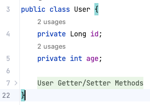
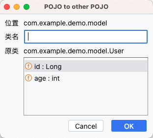
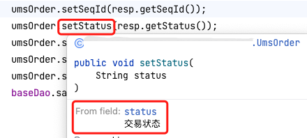

# 使用手册

::: tip

本插件并非极其重要且多有能耐的插件，但却是能一点一滴的节约时间，提升开发效率的。

每个功能都能从原来的十几步操作简化为几步即可完成。别小看这简化的几步，你可知：<Badge type="tip" text="积薄而为厚，聚少而为多。" vertical="middle" />

:::


### 1.自动折叠Getter/Setter代码

**背景：** 以前喜欢使用lombok，因为它可以省去许多编码，同时使整个类看着也简洁。但是随着使用发现存在很多问题，比如：一个人使用，就会强迫全团队同时使用，依赖于本项目的其他项目也必须使用；不分开发人员对lombok不了解，随意使用注解，导致bug；IDEA插件更新不及时，有些版本IDEA不兼容等等。鉴于此，我决定抛弃lombok，但一些类的 Getter/Setter 方法太多，不美观也不简洁，故此，自动折叠功能出现。

**使用：**  此功能无需主动调用，每次打开类时会自动为寻找连续的 Getter/Setter 方法，然后进行折叠。



### 2.注入Spring依赖类

**背景：** 在一个service类中编写代码，需要注入另一个service，此时会 拉倒类的最上方，手动输入 `@Autowired private XxService xxService;` 然后返回之前的地方继续编写，此步骤麻烦至极。

**使用：** 右键 出现 Toolbox 选择 `Autowired Dependency`，出现选择框，输入目标类前几个字母后确定，将会自动在类中注入目标类。

### 3. POJO类转为JSON字符串

**背景：** 写好接口后，肯定需要去写接口文档，定义接口入参和出数，一个个的输入太繁琐啦，大部分API管理平台都支持JSON格式导入解析，这样就方便多啦，所以将入参和出参转为JSON导入，非常方便。

**使用：** 右键 出现 Toolbox 选择 `Copy JSON` 即可，此时JSON已经复制到你的粘贴板了，去直接粘贴就行了。


### 4. POJO类指定部分属性生成新POJO

**背景：** 接口中的入参和出参，往往是有实体类的部分属性组成的，以往的做法是打开实体类选中部分需要的属性进行复制，然后创建一个新的类，粘贴其中，再定义其他额外的属性，然后生成Getter/Setter 方法。有了此功能你只要选择部分属性就可以自动生成类或属性的Getter/Setter 方法。

**使用：**  右键 出现 Toolbox 选择 `Generate POJO from Another` 后指定包，定义类名，选择不分属性后确定即可自动生成目标POJO类了。



### 5. 接口生成实现类

**背景：** 面向接口编程，在不使用特定的生成器下，我们总要先定义接口，定义方法，然后创建实现类，生成方法模版。过程也挺繁琐，于是就实现了只要定义好接口和方法，一键生成实现类和模版方法。

**使用：**  右键 出现 Toolbox 选择 `Generate Impl` 后，会在接口所在包下的impl包中自动生成实现类。

### 6. 属性单行注释转多行

**背景：** 许多同事喜欢在类的属性上进行单行注释，这会导致在引用的地方无法查看到该属性的意义，所以需要把单行注释改为多行，但一个个该显然比较麻烦，于是一键单行转多行就出现了。

**使用：**  右键 出现 Toolbox 选择 `Transform Multi Comment` 后，就会自动在类的属性上的单行注释改为多行注释。



### 7. 快速插入序列化号

**背景：** 对于网络通信、或文件存储等操作，就需要进行序列化和反序列化，想要进行此操作，我们的类必须实现接口`Serializable`，然后在生产序列化版本号`serialVersionUID`，但这个版本号并不会自动生成，于是我就实现了这个生成器。

**使用：**  右键 出现 Toolbox 选择 `Generate SerialVersionUID` 后，就会自动在类中生成版本号。

```java
public class User implements Serializable {
    private static final long serialVersionUID = 3888892742208114579L;
}
```


### 8.实体类生成属性的静态常量

**背景：** 在使用Mybatis-plus或hibernate中，尝尝使用实体类的属性名称来进行SQL的查询使用，如果直接手写属性名称的字符串，多个地方不方便改动同时还有拼写错误的几率，所以定义实体类属性名的静态常量是最好的方式。

**使用：**  右键 出现 Toolbox 选择 `Generate Static Constant` ，然后选择静态属性值是驼峰命名还是下划线命名，就会自动在类中生成所有属性对应的静态常量。

```java
//query.add(Restrictions.eq(User.AGE, age));
//wrapper.eq("nick_name", nickName);

public class User {
    private int age;
  	private String nickName;
    public static final String AGE = "age";
    public static final String NICK_NAME = "nickName";
 	 	//public static final String NICK_NAME = "nick_name";
}
```

